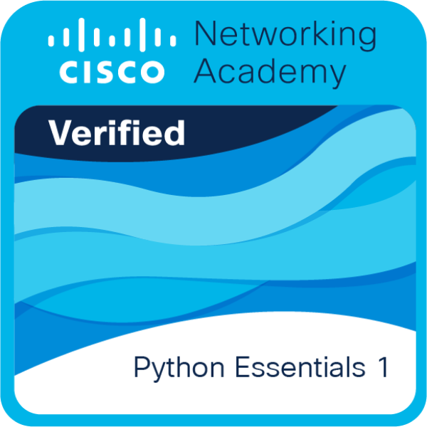

<h1 align="center">👋 Olá! Bem-vindo(a) ao meu GitHub!</h1>

  💻 <b>Desenvolvedora em formação</b> | 
  📊 <b>Entusiasta de Dados & IA</b> | 
  🎓 <b>Estudante de ADS</b>  
  
  <i style="color:#00ffea; text-shadow: 0 0 8px #00ffea;">"Transformando ideias em código, e dados em soluções inteligentes."</i>

  ⚡ Explorando <b style="color:#ff6ec7;">Machine Learning</b>, 
  🔮 <b style="color:#9f7aea;">Deep Learning</b>, 
  🌐 <b style="color:#00fff0;">Web Dev</b> e 
  🚀 <b style="color:#ffb86c;">IA aplicada</b>  
  🎯 Apaixonada por resolver problemas e criar projetos inovadores.

 

## 💻 Ferramentas Principais

    

    

    

 

## 🛠️ Tech Stack: Dados e IA

 

## 📜 Certificações

  <a href="https://www.credly.com/badges/f67694bb-70e2-435d-8f81-7779b8a83bc4/public_url">
     
    <b>Python Essentials 1</b> - Cisco
  </a>

 

## 🔝 Linguagens e Estatísticas

  <table>
    <tr>
      <td style="border: none;">
        
      </td>
      <td style="border: none;">
        
      </td>
    </tr>
  </table>
   

 

## 🐍 Contribuições

  

